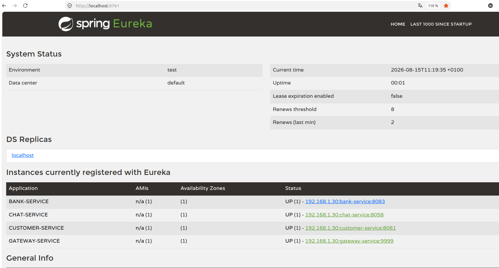
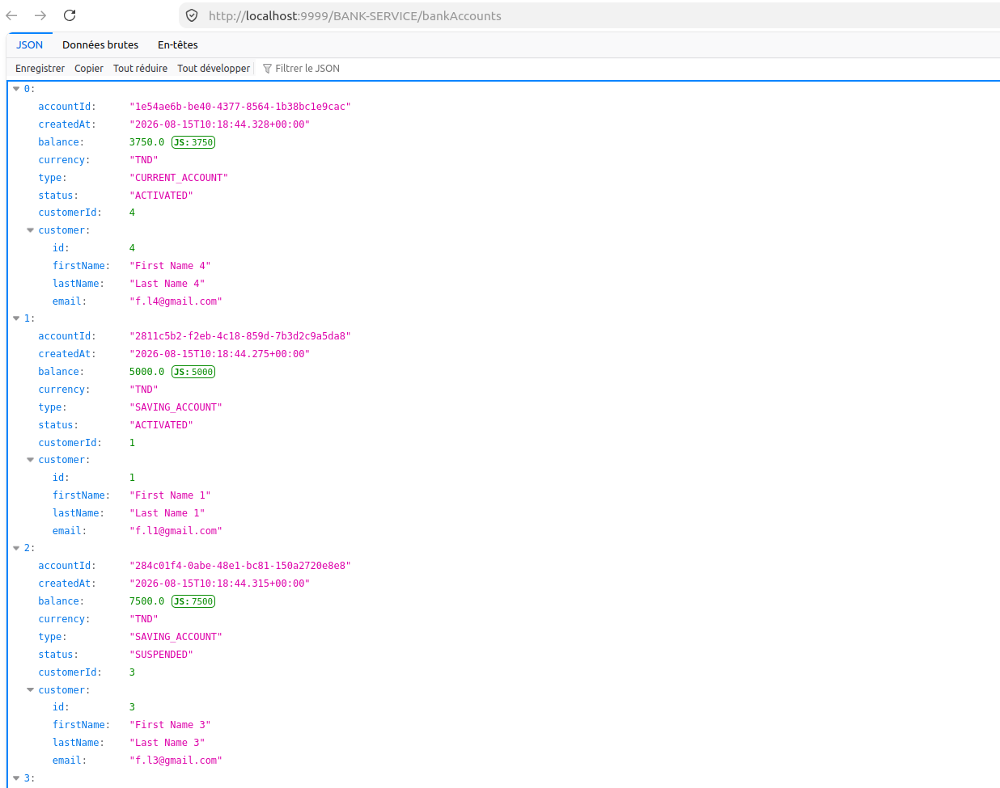
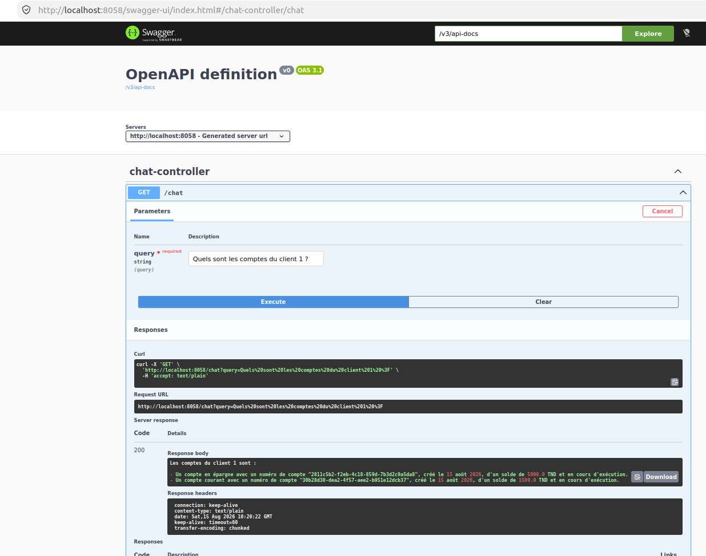

# intelligent-banking-microservices-platform

La partie **Backend** du projet **eBank & Chatbot IA** est désormais terminée.

Le backend repose sur une architecture **microservices** basée sur **Spring Boot** et **Spring Cloud**, avec notamment :

* **Spring Cloud Gateway** pour le routage des requêtes
* **Eureka Discovery Service** pour l’enregistrement et la découverte des microservices
* **Spring Cloud Config** pour la gestion centralisée des configurations
* **Customer Service** pour la gestion des clients
* **Ebank Service** pour la gestion des comptes bancaires
* **Chat Service** pour l’intégration du chatbot intelligent
* **OpenFeign** pour la communication entre les microservices
* **MCP Streamable** pour permettre au chatbot d’accéder aux fonctionnalités des services métiers
* **Spring AI** pour l’intégration de l’intelligence artificielle
* **Ollama / LLM** pour le traitement des requêtes en langage naturel
* **MySQL** pour la persistance des données

Le chatbot peut ainsi interagir avec les différents microservices afin de récupérer des informations bancaires et répondre aux demandes des utilisateurs en langage naturel.

## Prochaine étape

Le développement se poursuit maintenant avec la partie **Frontend sous Angular**, afin de créer une interface utilisateur moderne permettant d’interagir avec les différentes fonctionnalités de la plateforme.

**Backend : ✅ Terminé**

## 📸 Captures du projet

### Eureka Discovery Service

Les différents microservices sont enregistrés auprès du serveur Eureka.

### Bank Service

Exemple de récupération des comptes bancaires avec les informations des clients.

### Chatbot IA

Interaction avec le chatbot basé sur Spring AI, MCP et Ollama.

